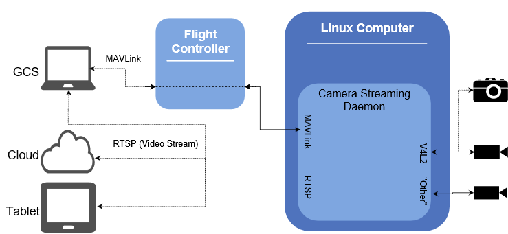

# Overview

The diagram below shows the main components of a "typical" system that is running the *Camera Streaming Daemon* on a Linux companion computer.
CSD connects to multiple cameras that are attached to the Linux computer. 
It provides access to them via the [MAVLink Camera Protocol](https://mavlink.io/en/protocol/camera.html) and RTSP video streams. It can also advertise available RTSP streams using Avahi. 

In the diagram above the GCS requests for camera actions are forwarded by PX4 - CSD can also take MAVLink requests directly, and may do so in different configurations.

## Key Features

CSD supports the following key features:

* Automatically attaches [compatible cameras](#supported_cameras) connected to the Linux computer when it is started.
* RTSP video streaming from *all* connected cameras (for consumption by GCS or other video players).
* RTSP video stream advertising/discovery using Avahi.
* [MAVLink Camera Protocol](#mavlink_support) support for up to 6 cameras, enabling image/video capture and storage, and querying/setting camera options.
* Gazebo simulated camera backend (so you can view video streams from within a simulated environment)!
* Configurable back-end that can be extended to interface with new types of cameras and new front-end protocols.

## Supported Cameras {#supported_cameras}

Cameras that support the [Video4Linux (V4L2) API](https://linuxtv.org/downloads/v4l-dvb-apis/uapi/v4l/v4l2.html) should work out of the box. 
The server can be [extended](../guide/extending_csd.md) to support other back-end camera protocols/APIs.

Some readily-available cameras that have been used in testing include: 
* Logitech C270 HD Webcam
* Sony PlayStation Eye Camera
* Intel RealSense 3D Camera

## Configuration Options {#configuration}

Compile-time configuration is provided through [build-configuration flags](../getting_started/building_installation.md#configure). These allow developers to enable support for: MAVLink, RTSP stream discovery using Avahi, RealSense Camera, Intel Aero bottom camera and Gazebo. RTSP streaming is always enabled.

Run-time configuration is provided by the [CSD Configuration File](../guide/configuration_file.md). Among other things, this allows users to set: location where captured images will be stored, devices that will not be connected, and settings required for defining the MAVLink node.

Advanced configuration information about individual cameras is specified in [Camera Definition Files](../guide/camera_definition_file.md). While not strictly part of CSD, these files are referenced in the [CSD Configuration File](../guide/configuration_file.md#uri) (and may be served on the same computer as CSD).

## MAVLink Camera Protocol Implementation {#mavlink_support}

CSD implements the [MAVLink Camera Protocol](https://mavlink.io/en/protocol/camera.html) for image and video capture and storage, and for getting/setting camera parameters and options.

The MAVLink properties of CSD are specified in the [CSD Configuration File](../guide/configuration_file.md):
* The [\[mavlink\]](../guide/configuration_file.md#mavlink) section is used to specify the MAVLink destination UDP port, the broadcast address for heartbeat messages, and (optionally) the system id.
* The [\[uri\]](../guide/configuration_file.md#uri) section specifies the device to URI mapping for [Camera Definition File](../guide/camera_definition_file.md).
* The [\[imgcap\]](../guide/configuration_file.md#imgcap) and [\[vidcap\]](../guide/configuration_file.md#vidcap) sections specify the *default settings* for image and video capture, respectively.

All cameras share the same MAVLink system ID. This can (optionally) be defined in the configuration file to match the id of the associated autopilot. If the system id is not defined in the configuration file then CSD will initially use the default PX4 vehicle system ID (1) and then change to the id of the first autopilot it detects.

Component IDs for each camera are allocated automatically and sequentially as cameras are connected, starting from [MAV_COMP_ID_CAMERA](https://mavlink.io/en/messages/common.html#MAV_COMP_ID_CAMERA). MAVLink supports up to 6 cameras in a system - once all component ids are allocated further cameras are not addressable. When the CSD is built with Gazebo enabled, the Gazebo camera has component ID `MAV_COMP_ID_CAMERA`.

**Limitations:**

* At time of writing (March 2018) the camera protocol, and hence CSD, do not yet include a formal specification for managing or advertising RTSP video streams.
* The MAVLink protocol supports up to 6 cameras in a single system (only 6 [camera component ids](https://mavlink.io/en/messages/common.html#MAV_COMP_ID_CAMERA) are defined). When CSD is configured for Gazebo one of these is reserved for the gazebo plugin camera.
* The default [image](../guide/configuration_file.md#imgcap) and [video](../guide/configuration_file.md#vidcap)
capture settings cannot (yet) be overwritten using parameters/via a [Camera Definition File](../guide/camera_definition_file.md) (see [#161](https://github.com/Dronecode/camera-streaming-daemon/issues/161)).
